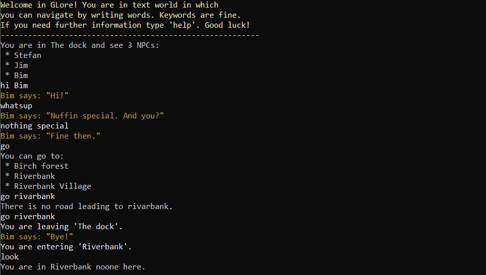

# GLore - text game

Text game in which you navigate by writing text. The terminal and imagination are your's GPU.

    

## Current game state
- Player can walk around test world and look at rooms content. Cool!
- Player can talk to NPCs. NPCs can have complex dialog based on keywords and dialog stages.
- Player has questlog, talking to NPCs can update questlog.
- Player has inventory with stackable and notstackable items. Can show content. 

## Gameplay
Start by typing '!help', it will show necessary commands. Try looking at room with 'look' or moving between rooms with 'go'. Start speaking with NPC by typing 'hi <npc_name>' and examin possible dialog keywords with 'hint'.
